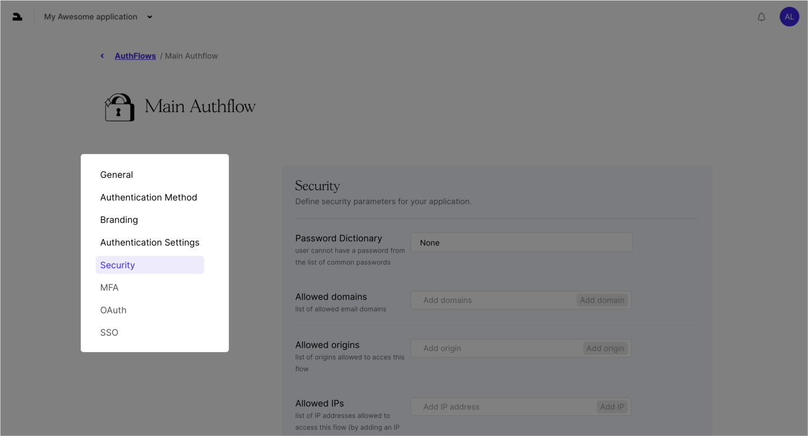

## Auth Flows

### What Are Auth Flows?

Auth Flows are where you customize how users interact with your app. Tailor the user experience and security settings to fit your needs.

- #### General:

  - Basic information like the name and description.
  - Most importantly, the ID used to configure both frontend and backend.

- #### Authentication Method:

  - Define the primary authentication process for your app.

- #### Branding:

  - Customize the appearance of the frontend library.
  - Adjust colors, borders, text, and logo to match your brand.

- #### Authentication Settings:

  - Configure parameters like password policy and token expiration.
  - Options to disable registration and more.

- #### Security:

  - Advanced settings such as IP whitelisting/blacklisting, country restrictions, and allowed domains.

- #### MFA:

  - Set up Multi-Factor Authentication (in progress).

- #### OAuth:

  - Configure social login options (in progress).

- #### SSO:

  - Set up Single Sign-On (in progress).

 
Auth Flows give you the flexibility to manage how users access and interact with
your application, ensuring both security and a seamless experience.
