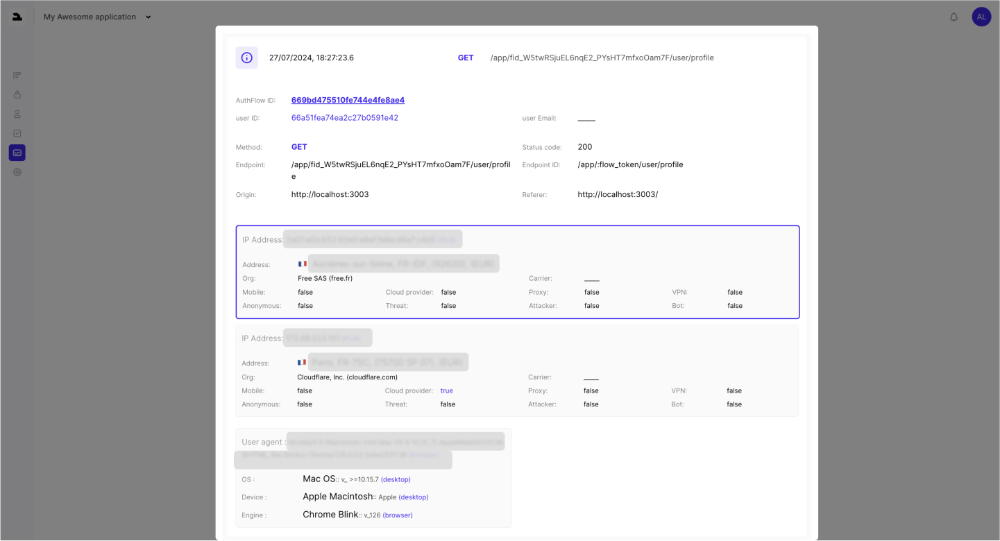

The Logs Page provides a comprehensive record of every API call made within your application. It includes detailed information such as IP addresses, user agents, and other metadata like whether the request originated from a bot or VPN.

## Features

- #### API Call Details:

    - Track every API request for auditing and debugging purposes.
- #### IP Address Insights:

    - Analyze IP information, including potential indicators of bots or VPN usage.
- #### User Agent Information:

    - View details about the devices and browsers accessing your application.

 
Currently, logs are primarily used for monitoring, but future updates will enable advanced analytics and insights.