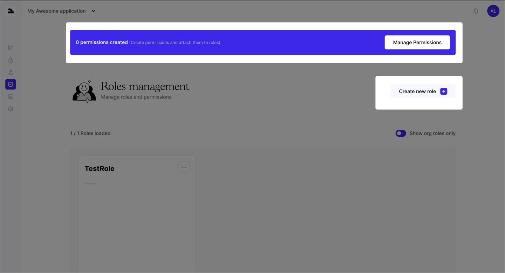

The Roles and Permissions pages are crucial for managing access and security within your application. They form the backbone of the Qoarks CLI tool, which uses these settings to enforce security rules.

## Permissions

Permissions define what actions users can perform and are divided into two main types:

- #### App-Level Permissions:

  - For generic endpoints that all users might access.

- #### Org-Level Permissions:

  - Used for organizational roles, acting as user roles within a specific organization.

In both cases, the key parameter is the API endpoint, which can be further customized in the advanced section to allow access for only specific cases.

## Roles

Roles simplify the assignment of permissions to users and are categorized into:

- #### App-Level Roles:

  - Automatically assigned to new users upon registration if marked as "Default."

- #### Org-Level Roles:

  - Specific to roles within an organization.

 
Roles streamline the process of managing permissions by grouping them, making it
easier to assign and manage user access efficiently.
