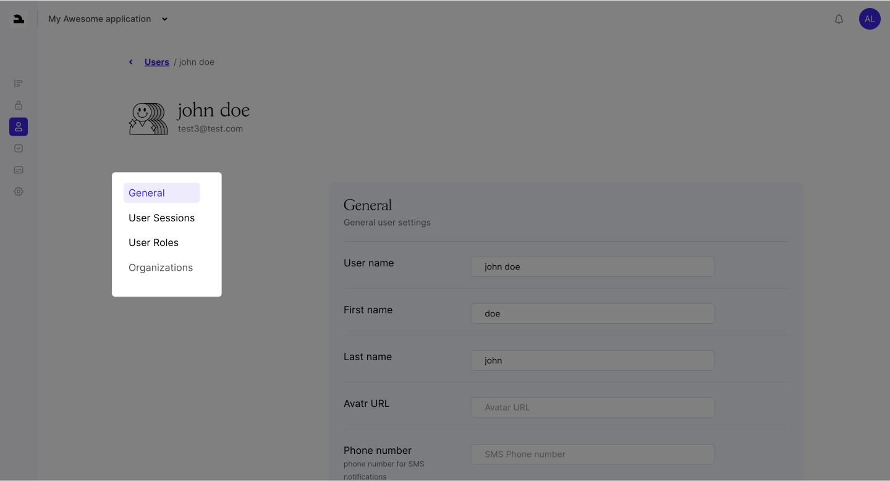

The Users Page is your hub for managing user accounts and their interactions with your app. It offers detailed insights and control over each user.

- #### General:

  - View and edit user details such as name and avatar.

- #### Sessions:

  - Access a log of user sessions, providing information on login times, IP addresses, and device details.

- #### Roles:

  - Manage user roles with ease. Assign or remove roles to control user permissions and access levels.

- #### Organizations:

  - Manage user organizations by assigning or removing users from different organizations. Easily manage their roles within each organization.

 
The Users Page ensures you have the tools to efficiently manage and monitor your
user base, enhancing security and user experience.
