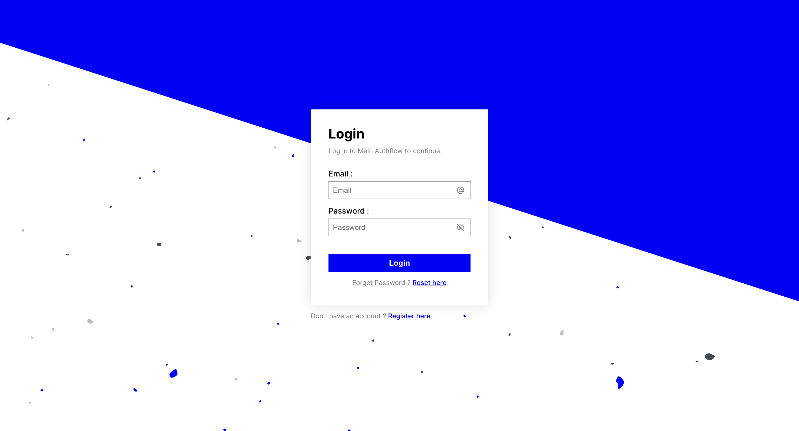

# Frontend Integration

The Qoarks frontend library is a versatile web component designed to seamlessly manage authentication for your application. It's built to be easily integrated into any frontend framework, providing a powerful yet simple way to handle user authentication flows.

Whether you're building a simple web app or a complex enterprise system, integrating Qoarks will streamline your authentication process, allowing you to focus on building great features while ensuring top-notch security.

<br />

To get started, follow these simple steps to install and integrate the Qoarks frontend library:

import { Tabs } from "nextra/components";
import { Steps } from "nextra/components";

<Steps>
    ### Install Qoarks Frontend Library<></>
    - Choose your preferred package manager:

    <Tabs items={['npm', 'yarn']}>
    <Tabs.Tab>
    ```copy
    npm install qoarks_lib
    ```
    </Tabs.Tab>
    <Tabs.Tab>
    ```copy
    yarn add qoarks_lib
    ```
    </Tabs.Tab>
    </Tabs>


    <br />

    ### Import the Library
    After installing the library, import it into your application.

    *the import serves just to load the library, everything is handled inside of the web-components*


    ```javascript copy
    import * as qoarks from "qoarks_lib";
    ```

    <br />

    ### Add the Qoarks Authentication Component
    Once the library is installed, add the Qoarks authentication component to your application:


    ```html copy
    <qoarks-auth flow_token="[AUTHFLOW_TOKEN_HERE]"></qoarks-auth>
    ```

</Steps>

<br />

With just these steps, you’ve integrated Qoarks into your frontend. The `<qoarks-auth>` component will handle everything related to user authentication, from sign-up and login to managing sessions.

You can further customize the appearance and behavior of this component using the options available in the Auth Flows section of your Qoarks dashboard. Tailor the look and feel to match your brand, set up security rules, and fine-tune how users interact with your app.

<br />


## Conclusion

Integrating Qoarks into your frontend is straightforward, making it an ideal solution for developers looking to add robust authentication to their applications with minimal effort. As you grow and your needs evolve, Qoarks offers extensive customization and security options to adapt to any situation, ensuring that your authentication process is always secure and user-friendly.

In the following sections, we'll dig deeper into each component and explore how you can fully leverage Qoarks in your application.