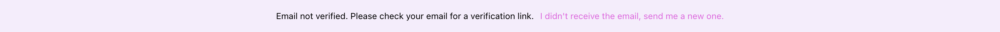

# qoarks-email-verify Component

import { Callout } from "nextra/components";

The `<qoarks-email-verify />` component manages email verification status for users. It informs users when their email address needs verification and provides an option to request a new verification email if necessary. It also includes a countdown timer to limit how frequently users can request new verification emails.

## Usage Example

```html copy
<qoarks-email-verify></qoarks-email-verify>
```

In this example, the `<qoarks-email-verify />` component will handle email verification notifications and resend requests, displaying relevant messages and timers as needed.

This will result in a banner styled according to user branding settings rendered in your page



<br />

## Conclusion
The `<qoarks-email-verify />` component is designed to streamline the email verification process, ensuring users receive timely notifications and have the ability to manage verification requests efficiently. It enhances user experience by providing clear feedback and controlling verification email requests.