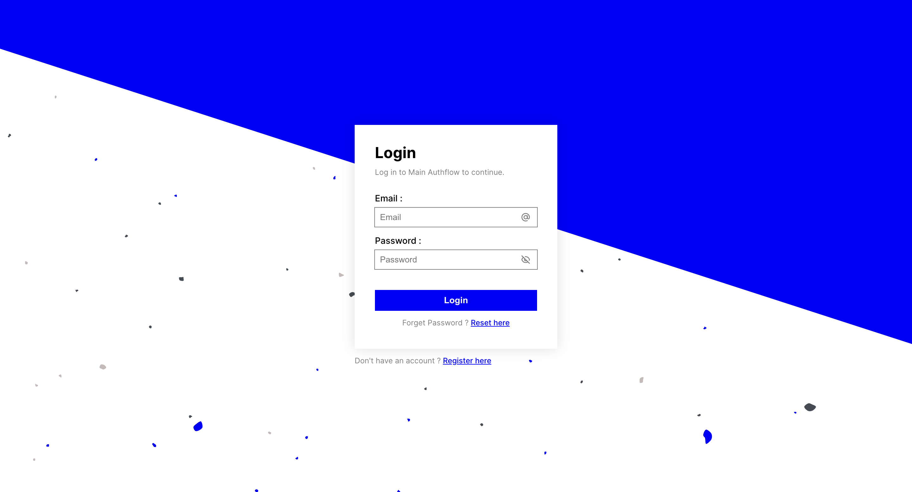

## Quick setup guide

Welcome to the quick and easy setup for Qoarks! Follow these steps to integrate authentication and authorization into your app.

import { Tabs } from "nextra/components";
import { Steps } from "nextra/components";

<Steps>
	### Sign Up and Create an Application<></>
	- Sign Up to Qoarks Auth.
    - Create a new application to get started.
    <br />
    
    <br />
    <br />
    <></>

    ### Set Up Auth Flows<></>
    - Navigate to the Auth Flows page.
    - Create a new auth flow and copy the Flow ID for your app.
    - Customize everything from looks to security rules in the Auth Flow Details page.<></>
    <br />
    
    <br />
    <br />
    <></>

    ### Integrate Frontend Library<></>
    - Install the frontend library.
    <Tabs items={['npm', 'yarn']}>
    <Tabs.Tab>
    ```copy
    npm install qoarks_lib
    ```
    </Tabs.Tab>
    <Tabs.Tab>
    ```copy
    yarn add qoarks_lib
    ```
    </Tabs.Tab>
    </Tabs>

    <br />

    - Add the following tag to your application:
    ```html copy
    <qoarks-auth flowToken="[AUTHFLOW_TOKEN_HERE]"></qoarks-auth>
    ```

    <br />

    - You're all set! Head back to the dashboard to customize more settings and effortlessly manage users, roles, and permissions.
    <br />
    

</Steps>

<br />
<br />

Now you're all set! With just a few steps, Qoarks enhances your app with powerful authentication and authorization. Enjoy exploring all the customization and security options!
